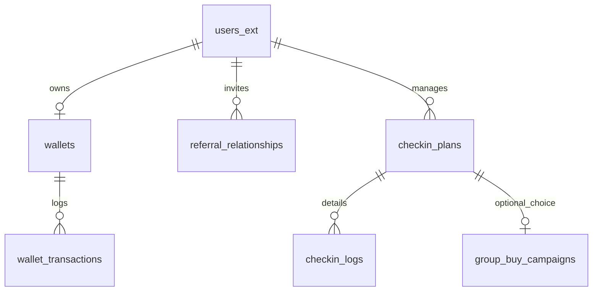

# 0Buck 签到与奖励逻辑数据库模型设计

## 1. 业务逻辑核心概述

根据 `0buck.md` 和 `PRD-新.md`，奖励体系包含三个核心模块：
- **签到返现 (Check-in Cashback)**: 555天内分20期，每期5%，需连续签到。
- **拼团免单 (Group-buy Free Order)**: 分享3人购买同款并确认收货，全额返现。
- **推广奖励 (Referral Rewards)**: 普通用户与达人（KOL）的分级分润，有效期2年。

---

## 2. 数据库表结构 (Schema)

### 2.1 用户扩展表 (`users_ext`)
扩展 Shopify Customer 数据，存储推荐关系和达人属性。
| 字段名 | 类型 | 说明 |
| :--- | :--- | :--- |
| `customer_id` | BIGINT | **Primary Key**, 对应 Shopify Customer ID |
| `inviter_id` | BIGINT | 推荐人 ID (References users_ext.customer_id) |
| `referral_code` | VARCHAR(20) | 专属邀请码 (Unique) |
| `user_type` | ENUM | 'customer', 'kol' |
| `kol_status` | ENUM | 'pending', 'approved', 'rejected' |
| `kol_one_time_rate` | DECIMAL(5,2) | 达人单次推广奖励比例 (8%-20%) |
| `kol_long_term_rate` | DECIMAL(5,2) | 达人2年长期奖励比例 (3%-8%) |
| `created_at` | TIMESTAMP | 创建时间 |

### 2.2 钱包与交易表 (`wallets` & `wallet_transactions`)
| 字段名 (`wallets`) | 类型 | 说明 |
| :--- | :--- | :--- |
| `user_id` | BIGINT | **Primary Key**, 对应 users_ext.customer_id |
| `balance_available` | DECIMAL(12,2) | 可提现余额 |
| `balance_locked` | DECIMAL(12,2) | 待结算/冻结余额 |
| `currency` | VARCHAR(10) | 币种 (USD) |

| 字段名 (`wallet_transactions`) | 类型 | 说明 |
| :--- | :--- | :--- |
| `id` | UUID | **Primary Key** |
| `user_id` | BIGINT | 用户 ID |
| `amount` | DECIMAL(12,2) | 交易金额 |
| `type` | ENUM | 'checkin', 'referral', 'group_buy', 'withdrawal', 'refund' |
| `status` | ENUM | 'pending', 'completed', 'failed' |
| `order_id` | BIGINT | 关联订单 ID (Shopify Order ID, 可选) |
| `description` | TEXT | 备注 |
| `created_at` | TIMESTAMP | 交易时间 |

### 2.3 签到计划表 (`checkin_plans`)
管理每个订单的签到进度。
| 字段名 | 类型 | 说明 |
| :--- | :--- | :--- |
| `id` | UUID | **Primary Key** |
| `user_id` | BIGINT | 用户 ID |
| `order_id` | BIGINT | Shopify 订单 ID |
| `reward_base` | DECIMAL(12,2) | 奖励基数 (实付 - 运费 - 税费) |
| `confirmed_at` | TIMESTAMP | 确认收货时间 |
| `expires_at` | TIMESTAMP | 555天截止时间 |
| `current_period` | INT | 当前期数 (1-20) |
| `consecutive_days` | INT | 当前期连续签到天数 |
| `status` | ENUM | 'pending_choice', 'active_checkin', 'active_groupbuy', 'completed', 'forfeited' |
| `total_earned` | DECIMAL(12,2) | 已累计获得金额 |
| `last_checkin_at` | DATE | 最近一次签到日期 |

### 2.4 签到日志表 (`checkin_logs`)
| 字段名 | 类型 | 说明 |
| :--- | :--- | :--- |
| `id` | BIGINT | **Primary Key** |
| `plan_id` | UUID | 关联 checkin_plans.id |
| `checkin_date` | DATE | 签到日期 |
| `period_num` | INT | 所属期数 |
| `day_num` | INT | 当前期的第几天 |

### 2.5 推荐关系表 (`referral_relationships`)
| 字段名 | 类型 | 说明 |
| :--- | :--- | :--- |
| `id` | UUID | **Primary Key** |
| `inviter_id` | BIGINT | 邀请人 ID |
| `invitee_id` | BIGINT | 被邀请人 ID |
| `start_at` | TIMESTAMP | 注册时间 |
| `expire_at` | TIMESTAMP | 2年有效期截止时间 |

### 2.6 拼团活动表 (`group_buy_campaigns`)
| 字段名 | 类型 | 说明 |
| :--- | :--- | :--- |
| `id` | UUID | **Primary Key** |
| `owner_order_id` | BIGINT | 发起者订单 ID |
| `share_code` | VARCHAR(20) | 专属分享码 (Unique) |
| `required_count` | INT | 需达标人数 (默认3) |
| `current_count` | INT | 当前已支付并确认人数 |
| `status` | ENUM | 'open', 'success', 'expired' |

---

## 3. 核心计算规则逻辑

### 3.1 签到奖励计算
- **每期奖励金**: `reward_base * 5%`
- **期数要求**:
  - P1: 连续 5 天
  - P2: 连续 10 天
  - P3-P20: 连续 30 天
- **中断规则**: 若签到中断（日期不连续），该期奖励判定失败，下次签到进入**下一期**的第一天。
- **555天结算**: 若 555 天到期，奖励 = `(当前期连续天数 / 30) * 5% * reward_base` (补差逻辑)。

### 3.2 推广分润逻辑
- **普通用户**: `(Amount - Shipping - Tax) * (1.5% - 3%)`
- **达人 (KOL)**:
  - 专属链接购买: `(Amount - Shipping - Tax) * (8% - 20%)`
  - 邀请新用户: `(Amount - Shipping - Tax) * (3% - 8%)` (2年内所有订单)

---

## 4. 与 Shopify 的衔接方案

### 4.1 Metafields 同步
为了保证数据一致性和前端访问效率，以下数据需同步至 Shopify Metafields:
- **Customer Metafields**: `referral_code`, `inviter_id`, `wallet_balance`.
- **Order Metafields**: `reward_type` (checkin/groupbuy), `checkin_status`.

### 4.2 Webhook 触发
- `orders/paid`: 检查是否有推荐关系，创建待处理奖励。
- `orders/updated`: 当状态变为 `fulfilled` 并被用户确认后（或通过物流 API 自动判定），触发 `confirmed_at` 并激活签到计划。

---

## 5. ER 图 (Mermaid)

